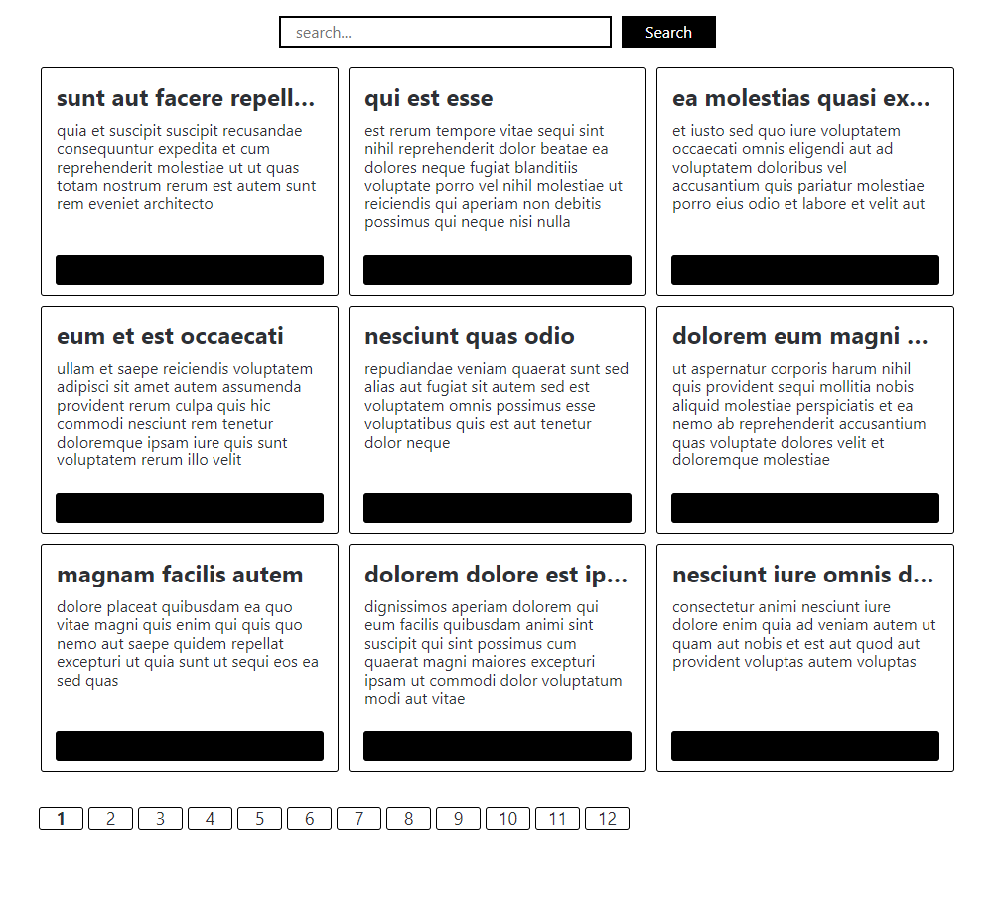
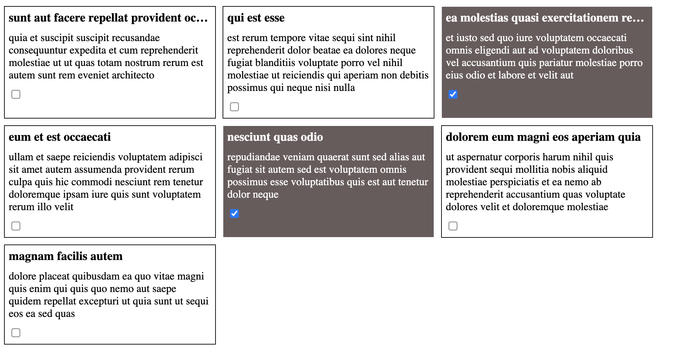

<h1>
  <a align="center" href="https://deploy-gate.vercel.app/">Сcылка на deploy</a>
</h1>

# Тестовое здание

1. Сделать GET запрос на адрес https://jsonplaceholder.typicode.com/posts/?_start=0&_limit=7
2. Обработать ответ и отрисовать элементы массива в html. 
3. К каждому элементу добавить чекбокс. 
4. При активном чекбоксе фон должен становиться темным, текст светлым. 
5. Добавить текстовый фильтр по заголовку.
   1. Состояние фильтра должен сохраняться в url.
   2. Фильтрация должна работать после нажатия на кнопку «найти».
6. Ширина элемента = 300 пикселей. 
7. Если длина заголовка превышает ширину блока, не переносить заголовок на вторую строку, а обрезать его троеточием 
8. Использовать только html, css, js (не использовать фреймворки и библиотеки)
9. Приветствуется визуальное оформление 

Пример выполненного задания на скриншоте (на скриншоте нет формы с фильтрами)

